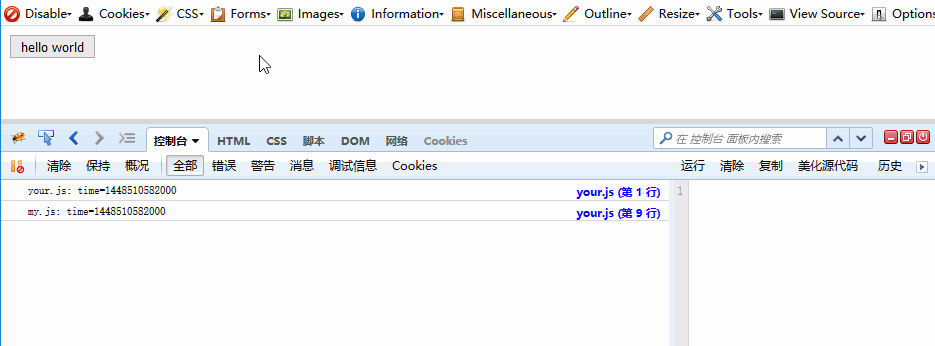
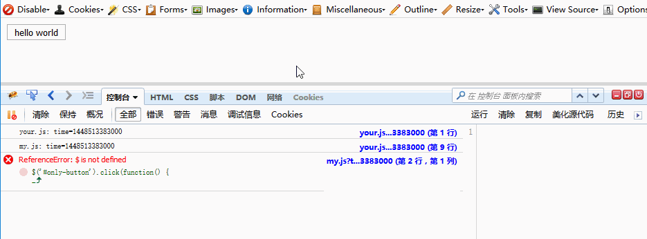
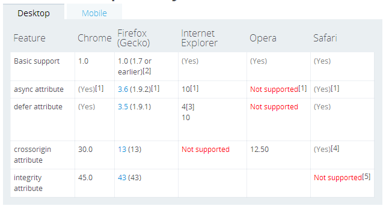
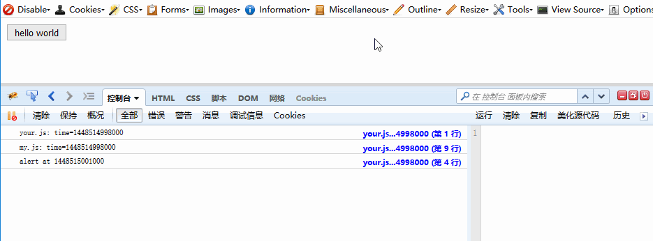
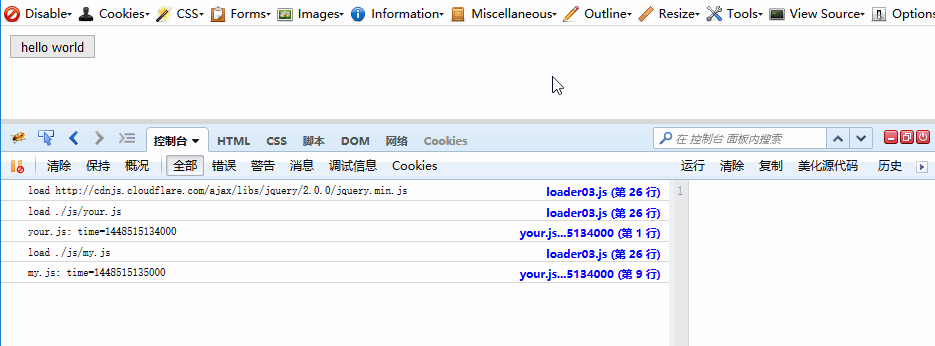
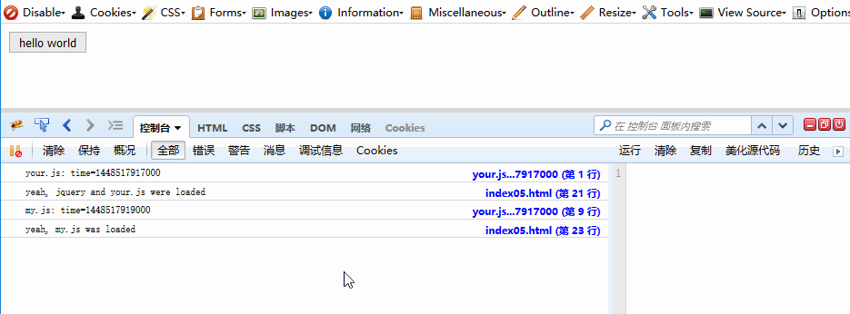
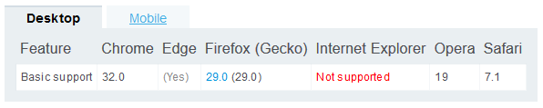
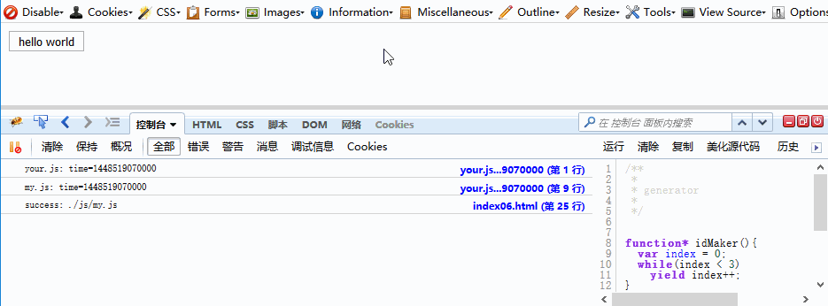
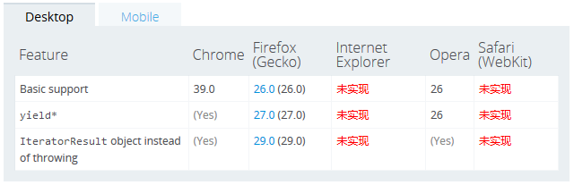
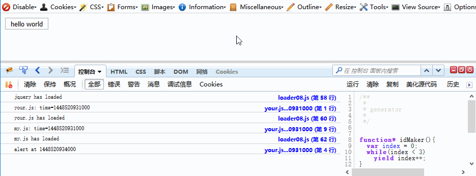

# 动态加载js文件的正确姿势


**说明：**

这个repository的结构：  
* `img/`：图片
* `LABjs-source/`：[LABjs](https://github.com/getify/LABjs)的源码，带注释，文中部分代码参考了该项目。
* `lazyload-source`：[lazyload](https://github.com/rgrove/lazyload)的源码，带注释，文中部分代码参考了该项目。
* `src/`：本文档中涉及的代码，**在Firefox 42中测试，使用Firebug观察和调试**。
* `README.md`：本文档。

本文中给出了多种解决方式，`方式1`对应的代码是`src/js/loader01.js`和`src/index01.js`，其他方式对应的代码位置类似。

> Gif图片使用[LICEcap](http://www.cockos.com/licecap/)生成。

**目录：**

* [硬编码在html源码中的script是如何加载的](#硬编码在html源码中的script是如何加载的)* [从一个例子出发](#从一个例子出发)
* [方式1：一个错误的加载方式](#方式1一个错误的加载方式)
* [方式2](#方式2)
* [方式3](#方式3)
* [方式4](#方式4)
* [方式5](#方式5)
* [方式6 Promise 串行](#方式6-promise串行)
* [方式7 Promise 并行](#方式7-promise并行)
* [方式8 Generator Promise](#方式8-generatorpromise)
* [现有哪些工具可以实现动态加载](#现有哪些工具可以实现动态加载)
* [其他](#其他)
* [资料](#资料)

---


最近在做一个为网页生成目录的工具[awesome-toc](https://github.com/someus/awesome-toc)，该工具提供了以jquery插件的形式使用的代码，也提供了一个基于[Bookmarklet](https://en.wikipedia.org/wiki/Bookmarklet)（小书签）的浏览器插件。

小书签需要向网页中注入多个js文件，也就相当于动态加载js文件。在编写这部分代码时候遇到坑了，于是深究了一段时间。

我在这里整理了动态加载js文件的若干思路，**这对于理解异步编程很有用处，而且也适用于Nodejs**。

## 硬编码在html源码中的script是如何加载的

如果html中有：
```html
<script type="text/javascript" src="1.js"></script>
<script type="text/javascript" src="2.js"></script>
```
那么，浏览器解析到
```html
<script type="text/javascript" src="1.js"></script>
```
会停止渲染页面，去拉取`1.js`（IO操作），等到`1.js`的内容获取到后执行。
1.js执行完毕后，浏览器解析到
```html
<script type="text/javascript" src="2.js"></script>
```
进行和`1.js`类似的操作。

不过现在部分浏览器支持async属性和defer属性，这个可以参考：

[async vs defer attributes](http://www.growingwiththeweb.com/2014/02/async-vs-defer-attributes.html)  
[script的defer和async](http://ued.ctrip.com/blog/script-defer-and-async.html)  

[script -MDN](https://developer.mozilla.org/en-US/docs/Web/HTML/Element/script)指出：async对内联脚本（inline script）没有影响，defer的话因浏览器以及版本不同而影响不同。

## 从一个例子出发

举个实际的例子：  

```html
<html>
<head></head>
<body>

    <div id="container">
        <div id="header"></div>
        <div id="body">
            <button id="only-button"> hello world</button>
        </div>
        <div id="footer"></div>
    </div>

    <script src="http://cdnjs.cloudflare.com/ajax/libs/jquery/2.0.0/jquery.min.js" type="text/javascript"></script>
    <script src="./your.js" type="text/javascript"></script>
    <script src="./my.js" type="text/javascript"></script>
    
</body>
</html>
```
js/your.js:
```js
console.log('your.js: time='+Date.parse(new Date()));

function myAlert(msg) {
    console.log('alert at ' + Date.parse(new Date()));
    alert(msg);
}

function myLog(msg) {
    console.log(msg);
}
```

js/my.js：
```js
myLog('my.js: time='+Date.parse(new Date()));
$('#only-button').click(function() {
    myAlert("hello world");
});
```

可以看出`jquery`、`js/your.js`、`js/my.js`三者的关系如下：

* `js/my.js`依赖于`jquery`和`js/your.js`。
* `jquery`和`js/your.js`之间没有依赖关系。

浏览器打开`index00.html`，等待js加载完毕，点击按钮`hello world`将会触发`alert("hello world");`。

firbug控制台输出：


下面开始探索如何动态加载js文件。

## 方式1：一个错误的加载方式

文件js/loader01.js内容如下：
```js
Loader = (function() {

  var loadScript = function(url) {
    var script = document.createElement( 'script' );
    script.setAttribute( 'src', url+'?'+'time='+Date.parse(new Date()));  // 不用缓存
    document.body.appendChild( script );
  };

  var loadMultiScript = function(url_array) {
    for (var idx=0; idx < url_array.length; idx++) {
      loadScript(url_array[idx]);
    }
  }

  return {
    load: loadMultiScript,
  };

})();  // end Loader
```

index01.html内容如下：
```html
<html>
<head></head>
<body>

    <div id="container">
        <div id="header"></div>
        <div id="body">
            <button id="only-button"> hello world</button>
        </div>
        <div id="footer"></div>
    </div>

    <script src="./js/loader01.js" type="text/javascript"></script>
    <script type="text/javascript">
        Loader.load([
                    'http://cdnjs.cloudflare.com/ajax/libs/jquery/2.0.0/jquery.min.js', 
                    './js/your.js',
                    './js/my.js'
                     ]);
    </script>
    
</body>
</html>
```

浏览器打开`index01.html`，点击按钮`hello world`，会发现什么都没发生。打开firebug，进入控制台，可以看到这样的错误：



很明显，`my.js`没等jquery就先执行了。又由于存在依赖关系，脚本的执行出现了错误。这不是我想要的。

在网上可以找到关于动态加载的一些说明，例如：

> Opera/Firefox（老版本）下：脚本执行的顺序与节点被插入页面的顺序一致
> 
> IE/Safari/Chrome下：执行顺序无法得到保证
> 
> 注意：
>
>   新版本的Firefox下，脚本执行的顺序与插入页面的顺序不一定一致，但可通过将script标签的async属性设置为false来保证顺序执行
>   老版本的Chrome下，脚本执行的顺序与插入页面的顺序不一定一致，但可通过将script标签的async属性设置为false来保证顺序执行

真够乱的！！（这段描述来自：[LABJS源码浅析](http://www.cnblogs.com/chyingp/archive/2012/10/17/2726898.html)。）

为了解决我们遇到的问题，我们可以在loadScript函数中修改script对象async的值：
```js
var loadScript = function(url) {
  var script = document.createElement('script');
  script.async = false;  // 这里
  script.setAttribute('src', url+'?'+'time='+Date.parse(new Date())); 
  document.body.appendChild(script);
};
```

浏览器打开，发现可以正常执行！可惜该方法只在某些浏览器的某些版本中有效，没有通用性。[script browser compatibility](https://developer.mozilla.org/en-US/docs/Web/HTML/Element/script#Browser_compatibility)给出了下面的兼容性列表：




下面探索的方法都可以正确的加载和执行多个脚本，不过有些同样有兼容性问题（例如Pormise方式）。

## 方式2

可以认为绝大部分浏览器动态加载脚本的方式如下：

1. 动态加载多个脚本时，这些脚本的加载（IO操作）可能并行，可能串行。  
2. 一个脚本一旦加载完毕（IO结束），该脚本放入“待执行队列”，等待出队供js引擎去执行。 

所以我们的示例中的三个js脚本的加载和执行顺序可以是下面的情况之一：

1. `jquery`加载并执行，`js/your.js`加载并执行，`js/my.js`加载并执行。
2. 和情况1类似，不过`js/your.js`在前，`jquery`在后。
3. `jquery`和`js/your.js`并行加载，按照加载完毕的顺序来执行；等`jquery`和`js/your.js`都执行完毕后，加载并执行`js/my.js`。


其中，“加载完毕”这是一个事件，浏览器的支持监测这个事件。这个事件在IE下是`onreadystatechange `，其他浏览器下是`onload `。

据此，[Loading JavaScript without blocking](https://www.nczonline.net/blog/2009/06/23/loading-javascript-without-blocking/)给出了下面的代码：

```js
function loadScript(url, callback){

    var script = document.createElement("script")
    script.type = "text/javascript";

    if (script.readyState){  //IE
        script.onreadystatechange = function(){
            if (script.readyState == "loaded" ||
                    script.readyState == "complete"){
                script.onreadystatechange = null;
                callback();
            }
        };
    } else {  //Others
        script.onload = function(){
            callback();
        };
    }

    script.src = url;
    document.body.appendChild(script);
}
```

callback函数可以是去加载另外一个js，不过如果要加载的js文件较多，就成了“回调地狱”（callback hell）。

回调地狱式可以通过一些模式来解决，例如下面给出的方式2：

```js
Loader = (function() {

  var load_cursor = 0;
  var load_queue;

  var loadFinished = function() {
    load_cursor ++;
    if (load_cursor < load_queue.length) {
      loadScript();
    }
  }

  function loadError (oError) {
    console.error("The script " + oError.target.src + " is not accessible.");
  }


  var loadScript = function() {
    var url = load_queue[load_cursor];
    var script = document.createElement('script');
    script.type = "text/javascript";

    if (script.readyState){  //IE
        script.onreadystatechange = function(){
            if (script.readyState == "loaded" ||
                    script.readyState == "complete"){
                script.onreadystatechange = null;
                loadFinished();
            }
        };
    } else {  //Others
        script.onload = function(){
            loadFinished();
        };
    }

    script.onerror = loadError;

    script.src = url+'?'+'time='+Date.parse(new Date());
    document.body.appendChild(script);
  };

  var loadMultiScript = function(url_array) {
    load_cursor = 0;
    load_queue = url_array;
    loadScript();
  }

  return {
    load: loadMultiScript,
  };

})();  // end Loader

//loading ...
Loader.load([
            'http://cdnjs.cloudflare.com/ajax/libs/jquery/2.0.0/jquery.min.js', 
            './js/your.js',
            './js/my.js'
             ]);
```

`load_queue`是一个队列，保存需要依次加载的js的url。当一个js加载完毕后，`load_cursor++`用来模拟出队操作，然后加载下一个脚本。

onerror事件也添加了回调，用来处理无法加载的js文件。当遇到无法加载的js文件时停止加载，剩下的文件也不会加载了。

效果如下：



## 方式3
方式2是串行的去加载，我们稍加改进，让可以并行加载的js脚本尽可能地并行加载。

```js
Loader = (function() {

  var group_queue;      // group list
  var group_cursor = 0; // current group cursor
  var current_group_finished = 0;  


  var loadFinished = function() {
    current_group_finished ++;
    if (current_group_finished == group_queue[group_cursor].length) {
      next_group();
      loadGroup();
    }
  };

  var next_group = function() {
    current_group_finished = 0;
    group_cursor ++;
  };

  var loadError = function(oError) {
    console.error("The script " + oError.target.src + " is not accessible.");
  };

  var loadScript = function(url) {
    console.log("load "+url);
    var script = document.createElement('script');
    script.type = "text/javascript";

    if (script.readyState){  //IE
        script.onreadystatechange = function() {
            if (script.readyState == "loaded" ||
                    script.readyState == "complete") {
                script.onreadystatechange = null;
                loadFinished();
            }
        };
    } else {  //Others
        script.onload = function(){
            loadFinished();
        };
    }

    script.onerror = loadError;

    script.src = url+'?'+'time='+Date.parse(new Date());
    document.body.appendChild(script);
  };

  var loadGroup = function() {
    if (group_cursor >= group_queue.length) 
      return;
    current_group_finished = 0;
    for (var idx=0; idx < group_queue[group_cursor].length; idx++) {
      loadScript(group_queue[group_cursor][idx]);
    }
  };

  var loadMultiGroup = function(url_groups) {
    group_cursor = 0;
    group_queue = url_groups;
    loadGroup();
  }

  return {
    load: loadMultiGroup,
  };

})();  // end Loader


//loading
var jquery = 'http://cdnjs.cloudflare.com/ajax/libs/jquery/2.0.0/jquery.min.js',
    your   = './js/your.js',
    my     = './js/my.js'
;
Loader.load([ [jquery, your], [my] ]);
```

`Loader.load([ [jquery, your], [my] ]);`代表着`jquery`和`js/your.js`先尽可能快地加载和执行，等它们执行结束后，加载并执行`./js/my.js`。

这里将每个子数组里的所有url看成一个group，group内部的脚本尽可能并行加载并执行，group之间则为串行。

这段代码里使用了一个计数器`current_group_finished`记录当前group中完成的url的数量，在这个数量和url的总数一致时，进入下一个group。

效果如下：  



## 方式4
该方式是对方式3中代码的重构。

```js
Loader = (function() {

  var group_queue = [];      // group list
  var current_group_finished = 0;  
  var finish_callback;
  var finish_context;

  var loadFinished = function() {
    current_group_finished ++;
    if (current_group_finished == group_queue[0].length) {
      next_group();
      loadGroup();
    }
  };

  var next_group = function() {
    group_queue.shift();
  };

  var loadError = function(oError) {
    console.error("The script " + oError.target.src + " is not accessible.");
  };

  var loadScript = function(url) {
    console.log("load "+url);
    var script = document.createElement('script');
    script.type = "text/javascript";

    if (script.readyState){  //IE
        script.onreadystatechange = function() {
            if (script.readyState == "loaded" ||
                    script.readyState == "complete") {
                script.onreadystatechange = null;
                loadFinished();
            }
        };
    } else {  //Others
        script.onload = function(){
            loadFinished();
        };
    }

    script.onerror = loadError;

    script.src = url+'?'+'time='+Date.parse(new Date());
    document.body.appendChild(script);
  };

  var loadGroup = function() {
    if (group_queue.length == 0) {
      finish_callback.call(finish_context);
      return;
    }
    current_group_finished = 0; 
    for (var idx=0; idx < group_queue[0].length; idx++) {
      loadScript(group_queue[0][idx]);
    }
  };

  var addGroup = function(url_array) {
    if (url_array.length > 0) {
      group_queue.push(url_array);
    }
  };

  var fire = function(callback, context) {
    finish_callback = callback || function() {};
    finish_context = context || {};
    loadGroup();
  };

  var instanceAPI = {
    load : function() {
      addGroup([].slice.call(arguments));
      return instanceAPI;
    },

    done : fire,
  };

  return instanceAPI;

})();  // end Loader


//loading
var jquery = 'http://cdnjs.cloudflare.com/ajax/libs/jquery/2.0.0/jquery.min.js',
    your   = './js/your.js',
    my     = './js/my.js'
;
// Loader.load(jquery, your).load(my).done();
Loader.load(jquery, your)
      .load(my)
      .done(function(){console.log(this.msg)}, {msg: 'finished'});
```

在调用多次load()函数后，必须调用done()函数。done()函数用来触发所有脚本的load。

## 方式5

这个方式是对方式4的重写。改进为调用load()时候尽可能去触发实际的load操作。

```js
// 这里调试用的代码我没有删除

Loader = (function() {

    var group_queue  = [];      // group list

    //// url_item = {url:str, start: false, finished：false}

    // 用于调试
    var log = function(msg) {
        return;
        console.log(msg);
    }

    var isFunc = function(obj) { 
        return Object.prototype.toString.call(obj) == "[object Function]"; 
    }

    var isArray = function(obj) { 
        return Object.prototype.toString.call(obj) == "[object Array]"; 
    }

    var isAllStart = function(url_items) {
        for (var idx=0; idx<url_items.length; ++idx) {
            if (url_items[idx].start == false )
                return false;
        }
        return true;
    }

    var isAnyStart = function(url_items) {
        for (var idx=0; idx<url_items.length; ++idx) {
            if (url_items[idx].start == true )
                return true;
        }
        return false;
    }

    var isAllFinished = function(url_items) {
        for (var idx=0; idx<url_items.length; ++idx) {
            if (url_items[idx].finished == false )
                return false;
        }
        return true;
    }

    var isAnyFinished = function(url_items) {
        for (var idx=0; idx<url_items.length; ++idx) {
            if (url_items[idx].finished == true )
                return true;
        }
        return false;
    }

    var loadFinished = function() {
        nextGroup();
    };

    var showGroupInfo = function() {
        for (var idx=0; idx<group_queue.length; idx++) {
            group = group_queue[idx];
            if (isArray(group)) {
                log('**********************');
                for (var i=0; i<group.length; i++) {
                    log('url:     '+group[i].url);
                    log('start:   '+group[i].start);
                    log('finished:'+group[i].finished);
                    log('-------------------');
                }
                log('isAllStart: ' + isAllStart(group));
                log('isAnyStart: ' + isAnyStart(group));
                log('isAllFinished: ' + isAllFinished(group));
                log('isAnyFinished: ' + isAnyFinished(group));
                log('**********************');
            }
        }
    };

    var nextGroup = function() {
        while (group_queue.length > 0) {
            showGroupInfo();
            // is Func
            if (isFunc(group_queue[0])) {
                log('## nextGroup: exec func');
                group_queue[0]();  // exec
                group_queue.shift();
                continue;
            // is Array
            } else if (isAllFinished(group_queue[0])) {   
                log('## current group all finished');
                group_queue.shift();
                continue;
            } else if (!isAnyStart(group_queue[0])) {
                log('## current group no one start!');
                loadGroup();
                break;
            } else {
                break;
            }
        }
    };

    var loadError = function(oError) {
        console.error("The script " + oError.target.src + " is not accessible.");
    };

    var loadScript = function(url_item) {
        log("load "+url_item.url);
        url = url_item.url;
        url_item.start = true;
        var script = document.createElement('script');
        script.type = "text/javascript";

        if (script.readyState){  //IE
            script.onreadystatechange = function() {
                if (script.readyState == "loaded" ||
                        script.readyState == "complete") {
                    script.onreadystatechange = null;
                    url_item.finished = true;
                    loadFinished();
                }
            };
        } else {  //Others
            script.onload = function(){
                url_item.finished = true;
                loadFinished();
            };
        }

        script.onerror = loadError;

        script.src = url+'?'+'time='+Date.parse(new Date());
        document.body.appendChild(script);
    };

    var loadGroup = function() {
        for (var idx=0; idx < group_queue[0].length; idx++) {
            loadScript(group_queue[0][idx]);
        }
    };

    var addGroup = function(url_array) {
        log('add :' + url_array);
        if (url_array.length > 0) {
            group = [];
            for (var idx=0; idx<url_array.length; idx++) {
                url_item = {
                    url: url_array[idx],
                    start: false,
                    finished: false,
                };
                group.push(url_item);
            }
            group_queue.push(group);
        }
        nextGroup();
    };

    var addFunc = function(callback) {
        callback && isFunc(callback) &&  group_queue.push(callback);
        log(group_queue);
        nextGroup();
    };

    var instanceAPI = {
        load : function() {
            addGroup([].slice.call(arguments));
            return instanceAPI;
        },

        wait : function(callback) {
            addFunc(callback);
            return instanceAPI;
        }
    };

    return instanceAPI;

})();  // end Loader，这尼玛就是一个状态机


// loading
var jquery = 'http://cdnjs.cloudflare.com/ajax/libs/jquery/2.0.0/jquery.min.js',
    your   = './js/your.js',
    my     = './js/my.js'
;
// Loader.load(jquery, your).load(my);
Loader.load(jquery, your)
      .wait(function(){console.log("yeah, jquery and your.js were loaded")})
      .load(my)
      .wait(function(){console.log("yeah, my.js was loaded")});
```

上面的调用中，每次load时候会尝试马上加载和执行这些脚本，而不是像方式4那样要等done()被调用。

另外出现了新的函数wait，当wait之前的load和wait执行结束后，该wait中的匿名函数会被调用。

效果如下：  


## 方式6 Promise+串行
Promise是一种设计模式。关于Promise，下面的几篇文章值得一看：

* [Promise - MDN](https://developer.mozilla.org/en-US/docs/Web/JavaScript/Reference/Global_Objects/Promise)
* [JavaScript Promises](http://www.html5rocks.com/zh/tutorials/es6/promises/)
* [JavaScript Promise迷你书（中文版）](http://liubin.github.io/promises-book/)
* [An Implemention of Promise](https://www.promisejs.org/implementing/)

当前浏览器对Promise的支持情况如下：



使用Promise解决脚本动态加载问题的方案如下：

```js
function getJS(url) {
    return new Promise(function(resolve, reject) {
        var script = document.createElement('script');
        script.type = "text/javascript";

        if (script.readyState){  //IE
            script.onreadystatechange = function() {
                if (script.readyState == "loaded" ||
                        script.readyState == "complete") {
                    script.onreadystatechange = null;
                    resolve('success: '+url);
                }
            };
        } else {  //Others
            script.onload = function(){
                resolve('success: '+url);
            };
        }

        script.onerror = function() {
            reject(Error(url + 'load error!'));
        };

        script.src = url+'?'+'time='+Date.parse(new Date());
        document.body.appendChild(script);

    });
}

//loading
var jquery = 'http://cdnjs.cloudflare.com/ajax/libs/jquery/2.0.0/jquery.min.js',
    your   = './js/your.js',
    my     = './js/my.js'
;

getJS(jquery).then(function(msg){
    return getJS(your);
}).then(function(msg){
    return getJS(my);
}).then(function(msg){
    console.log(msg);
});
```

这个实现中js是串行加载的。

效果如下：  


## 方式7 Promise+并行
可以使用[Promise.all](https://developer.mozilla.org/en-US/docs/Web/JavaScript/Reference/Global_Objects/Promise/all)使`jquery`和`js/your.js`并行加载。

```js
Promise.all([getJS(jquery), getJS(your)]).then(function(results){
    return getJS(my);
}).then(function(msg){
    console.log(msg);
});
```


## 方式8 Generator+Promise
Promise配合生成器（Generator）可以让js程序按照串行的思维编写。

关于生成器，下面的几篇文章值得一看：  
* [function* - MDN](https://developer.mozilla.org/zh-CN/docs/Web/JavaScript/Reference/Statements/function*)
* [The Basics Of ES6 Generators](https://davidwalsh.name/es6-generators)  

浏览器的支持情况如下：  


来两个典型的生成器示例：  

示例1：  
```
function *addGenerator() {
  var i = 0;
  while (true) {
    i += yield i;
  }
}

var adder = addGenerator();
console.log( adder.next().value );  // yield i时候暂停 （循环1）
console.log( adder.next(5).value ); // 循环1中yield i的结果为5，i+=5，进入下一个循环（循环2），循环2中yield i 暂停，返回5
console.log( adder.next(5).value ); // 循环2中yield i的结果为5
console.log( adder.next(5).value ); // 循环3中yield i的结果为5
console.log( adder.next(50).value ); //循环4中yield i的结果为50，i+=50，进入循环6
```

输出：
```plain
0
5
10
15
65
```

示例2：
```plain
function* idMaker(){
  var index = 0;
  while(index < 3)
    yield index++;
}

var gen = idMaker();

while ( result = gen.next() ) {
    if (!result.done) {
        console.log(result.done + ':' + result.value);
    } else{
        console.log(result.done + ':' + result.value);
        break;
    }
}
```
输出：
```
false:0
false:1
false:2
true:undefined
```

下面的文章介绍了如何搭配Promise和Generator：  
* [JavaScript Promises](http://www.html5rocks.com/zh/tutorials/es6/promises/) 的最后一节
* [Generators with Promise](https://www.promisejs.org/generators/)

Generator+Promise实现js脚本动态加载的方式如下：

```js
function getJS(url) {
    return new Promise(function(resolve, reject) {
        var script = document.createElement('script');
        script.type = "text/javascript";

        if (script.readyState){  //IE
            script.onreadystatechange = function() {
                if (script.readyState == "loaded" ||
                        script.readyState == "complete") {
                    script.onreadystatechange = null;
                    resolve('success: '+url);
                }
            };
        } else {  //Others
            script.onload = function() {
                resolve('success: '+url);
            };
        }

        script.onerror = function() {
            reject(Error(url + 'load error!'));
        };

        script.src = url+'?'+'time='+Date.parse(new Date());
        document.body.appendChild(script);

    });
}

function spawn(generatorFunc) {
  function continuer(verb, arg) {
    var result;
    try {
      result = generator[verb](arg);  // 这个result是生成器的返回值，有value和done两个属性
    } catch (err) {
      return Promise.reject(err);
    }
    if (result.done) {
      return result.value;
    } else {
      return Promise.resolve(result.value).then(onFulfilled, onRejected);  // result.value是promise对象
    }
  }
  var generator = generatorFunc();
  var onFulfilled = continuer.bind(continuer, "next");
  var onRejected = continuer.bind(continuer, "throw");
  return onFulfilled();
}

//// loading

var jquery = 'http://cdnjs.cloudflare.com/ajax/libs/jquery/2.0.0/jquery.min.js',
    your   = './js/your.js',
    my     = './js/my.js'
;

// “串行”代码在这里
spawn(function*() {
    try {
        yield getJS(jquery);
        console.log('jquery has loaded');
        yield getJS(your);
        console.log('your.js has loaded');
        yield getJS(my);
        console.log('my.js has loaded');
    } catch (err) { 
        console.log(err);
    }
});
```

效果如下：  




## 现有哪些工具可以实现动态加载
在[For Your Script Loading Needs](http://code.tutsplus.com/articles/for-your-script-loading-needs--net-19570)列出了许多工具，例如[lazyload](https://github.com/rgrove/lazyload)、[LABjs](https://github.com/getify/LABjs)、[RequireJS](http://requirejs.org/)等。

有些工具也提供了新的思路，例如LABjs中可以使用ajax获取同域下的js文件。

## 其他

[async](https://github.com/caolan/async)

[q](https://github.com/kriskowal/q)

[co](https://github.com/tj/co)


## 资料
[Script Execution Control](https://wiki.whatwg.org/wiki/Script_Execution_Control#Proposal_1_.28Nicholas_Zakas.29)

[LABJS源码浅析](http://www.cnblogs.com/chyingp/archive/2012/10/17/2726898.html)

[Dynamic Script Execution Order](https://wiki.whatwg.org/wiki/Dynamic_Script_Execution_Order)

[script节点的onload,onreadystatechange事件](http://javne.iteye.com/blog/691262)

[readystatechange - MDN](https://developer.mozilla.org/en-US/docs/Web/Events/readystatechange)

[readyState property - MSDN](https://msdn.microsoft.com/en-us/library/ms534359%28v=vs.85%29.aspx)  

[Loading JavaScript without blocking](https://www.nczonline.net/blog/2009/06/23/loading-javascript-without-blocking/)  


